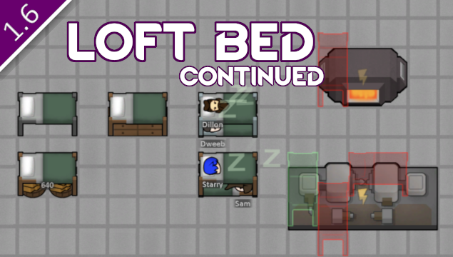

# Loft Bed (Continued)

This is a continuation of zed_0xff's Loft Bed mod which has been updated to work in 1.6.

## Original Description

A loft bed is a double level bed similar to a bunk bed, but it only has one mattress. The top bunk is usually for sleeping while the bottom bunk is used as a study area by way of a desk.

Stuffable as a regular bed.
You can build bunk beds with this one just by placing it over an existing regular bed.
By default you can't place loft beds over a structures with cover > 50%, but this can be changed in mod settings.